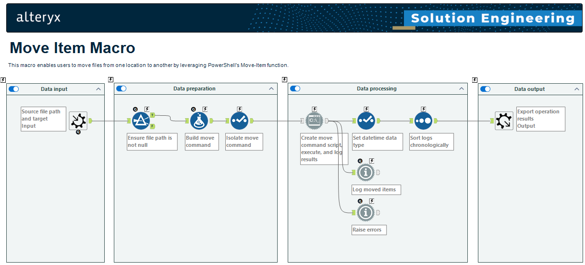
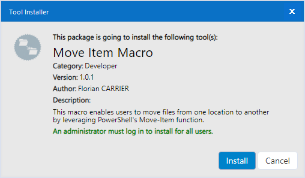
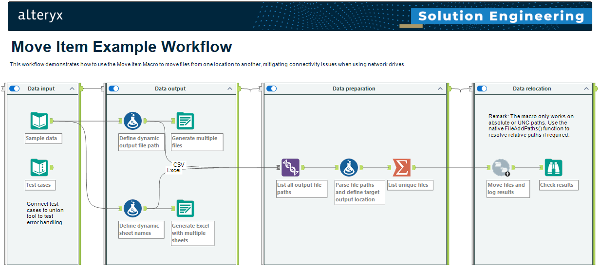

# Alteryx Move Item Macro

This repository provides a macro for [Alteryx Designer Desktop](https://www.alteryx.com/products/alteryx-designer) to enable users to easily move files from one location to another by leveraging PowerShell's Move-Item function.

## Installation

A standard Alteryx Tool Installer (.YXI) file is provided. Upon executing the installer, the macro will be setup on the local machine and made available in Alteryx Designer Desktop under the "Developer" tool category.

## Usage

### Configuration

The macro requires a single input and provides two configuration parameters:

1. Source: The full file path of the item to be moved. This can be a file of a directory.
2. Target: The full file path of the destination where the item should be moved to. This must be a directory.

### Example

Upon installation, an example workflow will be made available in Alteryx Designer Desktop under `Help > Sample Workflows > Macros > Move Item Example Workflow`.

## Dependencies

### Run Command Tool

The Alteryx Move Item Macro utilises the [Run Command Tool](https://help.alteryx.com/current/designer/run-command-tool). The Run Command Tool is included with Alteryx Designer Desktop by default, but can be disabled for execution when enabling [safe mode](https://help.alteryx.com/current/en/server/administer-alteryx-server/workflows--admin-interface/safe-and-semi-safe-run-modes--blocked-tools,-events,-and-data-connectors) on Alteryx Server.

### PowerShell

The Alteryx Move Item Macro utilises [PowerShell's Move-Item function](https://learn.microsoft.com/en-us/powershell/module/microsoft.powershell.management/move-item) to move files. Therefore, PowerShell must be installed on the machine executing the macro, but this requirement should be satisfied by default on modern Windows operating systems.

> [Windows PowerShell 5.1 is installed by default on Windows Server version 2016 and higher and Windows client version 10 and higher.](https://learn.microsoft.com/en-us/powershell/module/microsoft.powershell.core/about/about_windows_powershell_5.1)

### PSAYX PowerShell module

In order to build the Alteryx Installer (.YXI) using the provided [Build-YXI](Build-YXI.ps1) PowerShell script, the [PSAYX PowerShell module](https://www.powershellgallery.com/packages/PSAYX) is required.
